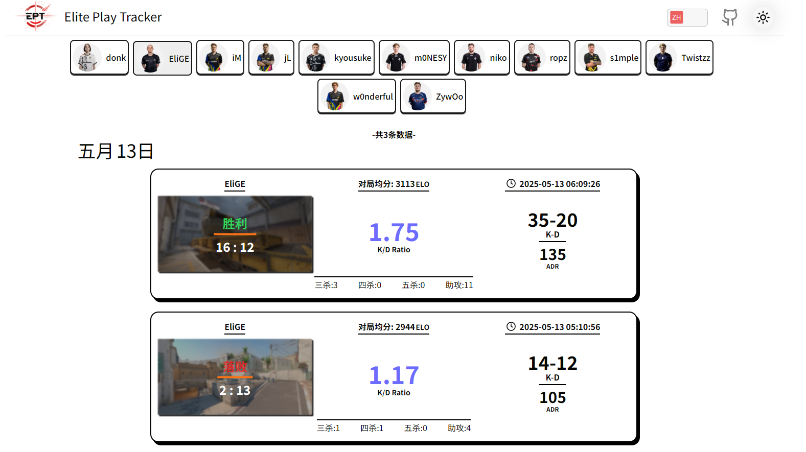

# Elite Play Tracker

<div align="center">
  <a href="https://eptracker.pro/donk/" target='_blank'>
    
  </a>
  <div><strong>Elite Play Tracker</strong> 是一个跟踪CS2职业选手(目前都是职业选手)在Faceit平台上每一场对局的部分数据的web项目,对局数据由它的后端 <a herf="https://github.com/zjssun/ElitePlay-Tracker-Express"><strike>ElitePlay-Tracker-Express</strike></a>👉<a herf="https://github.com/zjssun/api-hub">API-HUB</a>提供。</div>
  <div><strong>Elite Play Tracker</strong> is a web project that tracks partial data from every Faceit match played by CS2 pros (currently all pros), provided by its backend, <a herf="https://github.com/zjssun/ElitePlay-Tracker-Express"><strike>ElitePlay-Tracker-Express</strike></a>👉<a herf="https://github.com/zjssun/api-hub">API-HUB</a>.</div>
  
  <p>Screenshot of Elite Play Tracker</p>
</div>

---

## 技术支持 | Tech Stack 🚀

       

---

## 更新历史 | Update History 📜

**2026 年**

- 2026-02-06：从React移植为vue3。*Convert from React to Vue 3.*
- 2026-02-07：优化 Header 组件的样式和功能；*Optimize the styles and functionality of the Header component.*

## 部署到本地 | Deploy to Local

1. 克隆仓库 *Clone Repo*

```
git clone https://github.com/zjssun/ElitePlayTracker-Vue.git
```

2. 安装依赖 *Install Dependencies*

```
npm install
```

3. 修改/src/utils/[api.ts](https://github.com/zjssun/ElitePlayTracker-React/blob/master/src/utils/api.ts)文件 *Modify the api.ts file*

```js
axios.defaults.baseURL = 'http://localhost:3000';//修改为你的后端地址 change to your backend address
```

4. 启动项目 *Start Project*

```
npm run dev
```

